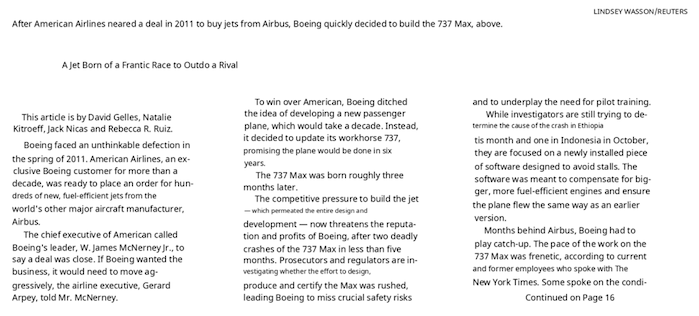
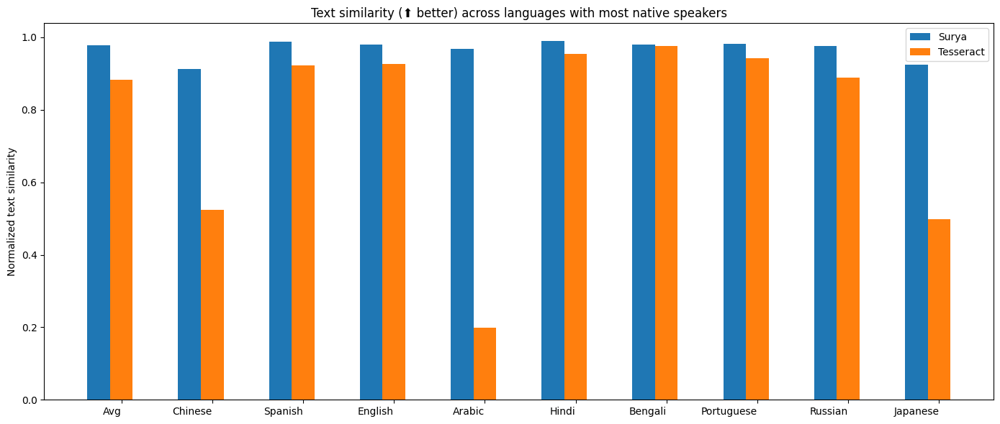
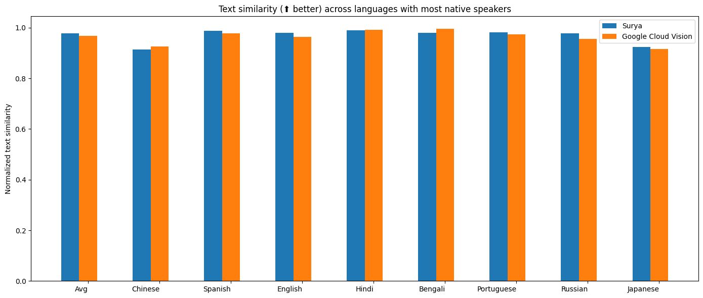
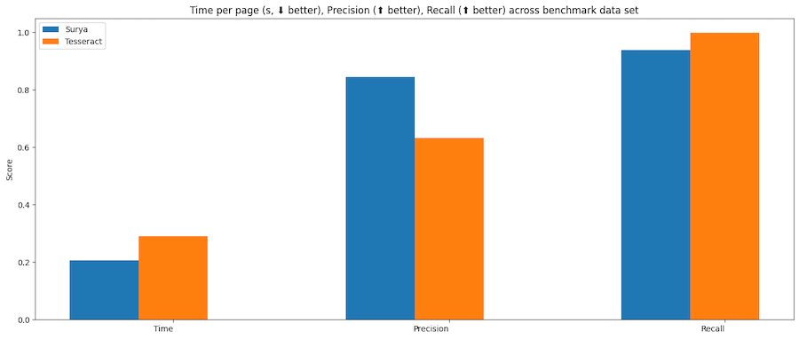
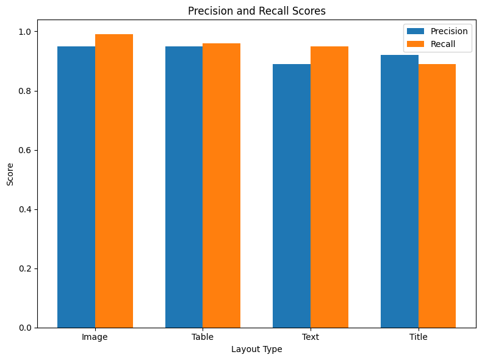

# Surya

Surya is a document OCR toolkit that does:

- OCR in 90+ languages that benchmarks favorably vs cloud services
- Line-level text detection in any language
- Layout analysis (table, image, header, etc detection)
- Reading order detection

It works on a range of documents (see [usage](#usage) and [benchmarks](#benchmarks) for more details).

|                            Detection                             |                                   OCR                                   |
|:----------------------------------------------------------------:|:-----------------------------------------------------------------------:|
|    |    |

|                               Layout                               |                               Reading Order                                |
|:------------------------------------------------------------------:|:--------------------------------------------------------------------------:|
|  |  |

Surya is named for the [Hindu sun god](https://en.wikipedia.org/wiki/Surya), who has universal vision.

## Community

[Discord](https://discord.gg//KuZwXNGnfH) is where we discuss future development.

## Examples

| Name             |              Detection              |                                      OCR |                                     Layout |                                       Order |
|------------------|:-----------------------------------:|-----------------------------------------:|-------------------------------------------:|--------------------------------------------:|
| Japanese         | [Image](static/images/japanese.jpg) | [Image](static/images/japanese_text.jpg) | [Image](static/images/japanese_layout.jpg) | [Image](static/images/japanese_reading.jpg) |
| Chinese          | [Image](static/images/chinese.jpg)  |  [Image](static/images/chinese_text.jpg) |  [Image](static/images/chinese_layout.jpg) |  [Image](static/images/chinese_reading.jpg) |
| Hindi            |  [Image](static/images/hindi.jpg)   |    [Image](static/images/hindi_text.jpg) |    [Image](static/images/hindi_layout.jpg) |    [Image](static/images/hindi_reading.jpg) |
| Arabic           |  [Image](static/images/arabic.jpg)  |   [Image](static/images/arabic_text.jpg) |   [Image](static/images/arabic_layout.jpg) |   [Image](static/images/arabic_reading.jpg) |
| Chinese + Hindi  | [Image](static/images/chi_hind.jpg) | [Image](static/images/chi_hind_text.jpg) | [Image](static/images/chi_hind_layout.jpg) | [Image](static/images/chi_hind_reading.jpg) |
| Presentation     |   [Image](static/images/pres.png)   |     [Image](static/images/pres_text.jpg) |     [Image](static/images/pres_layout.jpg) |     [Image](static/images/pres_reading.jpg) |
| Scientific Paper |  [Image](static/images/paper.jpg)   |    [Image](static/images/paper_text.jpg) |    [Image](static/images/paper_layout.jpg) |    [Image](static/images/paper_reading.jpg) |
| Scanned Document | [Image](static/images/scanned.png)  |  [Image](static/images/scanned_text.jpg) |  [Image](static/images/scanned_layout.jpg) |  [Image](static/images/scanned_reading.jpg) |
| New York Times   |   [Image](static/images/nyt.jpg)    |      [Image](static/images/nyt_text.jpg) |      [Image](static/images/nyt_layout.jpg) |        [Image](static/images/nyt_order.jpg) |
| Scanned Form     |  [Image](static/images/funsd.png)   |    [Image](static/images/funsd_text.jpg) |    [Image](static/images/funsd_layout.jpg) |    [Image](static/images/funsd_reading.jpg) |
| Textbook         | [Image](static/images/textbook.jpg) | [Image](static/images/textbook_text.jpg) | [Image](static/images/textbook_layout.jpg) |   [Image](static/images/textbook_order.jpg) |

# Installation

You'll need python 3.9+ and PyTorch. You may need to install the CPU version of torch first if you're not using a Mac or a GPU machine.  See [here](https://pytorch.org/get-started/locally/) for more details.

Install with:

```shell
pip install surya-ocr
```

Model weights will automatically download the first time you run surya.  Note that this does not work with the latest version of transformers `4.37+` [yet](https://github.com/huggingface/transformers/issues/28846#issuecomment-1926109135), so you will need to keep `4.36.2`, which is installed with surya.

# Usage

- Inspect the settings in `surya/settings.py`.  You can override any settings with environment variables.
- Your torch device will be automatically detected, but you can override this.  For example, `TORCH_DEVICE=cuda`. For text detection, the `mps` device has a bug (on the [Apple side](https://github.com/pytorch/pytorch/issues/84936)) that may prevent it from working properly.

## Interactive App

I've included a streamlit app that lets you interactively try Surya on images or PDF files.  Run it with:

```shell
pip install streamlit
surya_gui
```

Pass the `--math` command line argument to use the math text detection model instead of the default model.  This will detect math better, but will be worse at everything else.

## OCR (text recognition)

This command will write out a json file with the detected text and bboxes:

```shell
surya_ocr DATA_PATH --images --langs hi,en
```

- `DATA_PATH` can be an image, pdf, or folder of images/pdfs
- `--langs` specifies the language(s) to use for OCR.  You can comma separate multiple languages (I don't recommend using more than `4`). Use the language name or two-letter ISO code from [here](https://en.wikipedia.org/wiki/List_of_ISO_639_language_codes).  Surya supports the 90+ languages found in `surya/languages.py`.
- `--lang_file` if you want to use a different language for different PDFs/images, you can specify languages here.  The format is a JSON dict with the keys being filenames and the values as a list, like `{"file1.pdf": ["en", "hi"], "file2.pdf": ["en"]}`.
- `--images` will save images of the pages and detected text lines (optional)
- `--results_dir` specifies the directory to save results to instead of the default
- `--max` specifies the maximum number of pages to process if you don't want to process everything
- `--start_page` specifies the page number to start processing from

The `results.json` file will contain a json dictionary where the keys are the input filenames without extensions.  Each value will be a list of dictionaries, one per page of the input document.  Each page dictionary contains:

- `text_lines` - the detected text and bounding boxes for each line
  - `text` - the text in the line
  - `confidence` - the confidence of the model in the detected text (0-1)
  - `polygon` - the polygon for the text line in (x1, y1), (x2, y2), (x3, y3), (x4, y4) format.  The points are in clockwise order from the top left.
  - `bbox` - the axis-aligned rectangle for the text line in (x1, y1, x2, y2) format.  (x1, y1) is the top left corner, and (x2, y2) is the bottom right corner.
- `languages` - the languages specified for the page
- `page` - the page number in the file
- `image_bbox` - the bbox for the image in (x1, y1, x2, y2) format.  (x1, y1) is the top left corner, and (x2, y2) is the bottom right corner.  All line bboxes will be contained within this bbox.

**Performance tips**

Setting the `RECOGNITION_BATCH_SIZE` env var properly will make a big difference when using a GPU.  Each batch item will use `50MB` of VRAM, so very high batch sizes are possible.  The default is a batch size `256`, which will use about 12.8GB of VRAM.  Depending on your CPU core count, it may help, too - the default CPU batch size is `32`.

### From python

```python
from PIL import Image
from surya.ocr import run_ocr
from surya.model.detection import segformer
from surya.model.recognition.model import load_model
from surya.model.recognition.processor import load_processor

image = Image.open(IMAGE_PATH)
langs = ["en"] # Replace with your languages
det_processor, det_model = segformer.load_processor(), segformer.load_model()
rec_model, rec_processor = load_model(), load_processor()

predictions = run_ocr([image], [langs], det_model, det_processor, rec_model, rec_processor)
```

## Text line detection

This command will write out a json file with the detected bboxes.

```shell
surya_detect DATA_PATH --images
```

- `DATA_PATH` can be an image, pdf, or folder of images/pdfs
- `--images` will save images of the pages and detected text lines (optional)
- `--max` specifies the maximum number of pages to process if you don't want to process everything
- `--results_dir` specifies the directory to save results to instead of the default
- `--math` uses a specialized math detection model instead of the default model.  This will be better at math, but worse at everything else.

The `results.json` file will contain a json dictionary where the keys are the input filenames without extensions.  Each value will be a list of dictionaries, one per page of the input document.  Each page dictionary contains:

- `bboxes` - detected bounding boxes for text
  - `bbox` - the axis-aligned rectangle for the text line in (x1, y1, x2, y2) format.  (x1, y1) is the top left corner, and (x2, y2) is the bottom right corner.
  - `polygon` - the polygon for the text line in (x1, y1), (x2, y2), (x3, y3), (x4, y4) format.  The points are in clockwise order from the top left.
  - `confidence` - the confidence of the model in the detected text (0-1)
- `vertical_lines` - vertical lines detected in the document
  - `bbox` - the axis-aligned line coordinates.
- `horizontal_lines` - horizontal lines detected in the document
  - `bbox` - the axis-aligned line coordinates.
- `page` - the page number in the file
- `image_bbox` - the bbox for the image in (x1, y1, x2, y2) format.  (x1, y1) is the top left corner, and (x2, y2) is the bottom right corner.  All line bboxes will be contained within this bbox.

**Performance tips**

Setting the `DETECTOR_BATCH_SIZE` env var properly will make a big difference when using a GPU.  Each batch item will use `280MB` of VRAM, so very high batch sizes are possible.  The default is a batch size `32`, which will use about 9GB of VRAM.  Depending on your CPU core count, it might help, too - the default CPU batch size is `2`.

### From python

```python
from PIL import Image
from surya.detection import batch_text_detection
from surya.model.detection.segformer import load_model, load_processor

image = Image.open(IMAGE_PATH)
model, processor = load_model(), load_processor()

# predictions is a list of dicts, one per image
predictions = batch_text_detection([image], model, processor)
```

## Layout analysis

This command will write out a json file with the detected layout.

```shell
surya_layout DATA_PATH --images
```

- `DATA_PATH` can be an image, pdf, or folder of images/pdfs
- `--images` will save images of the pages and detected text lines (optional)
- `--max` specifies the maximum number of pages to process if you don't want to process everything
- `--results_dir` specifies the directory to save results to instead of the default

The `results.json` file will contain a json dictionary where the keys are the input filenames without extensions.  Each value will be a list of dictionaries, one per page of the input document.  Each page dictionary contains:

- `bboxes` - detected bounding boxes for text
  - `bbox` - the axis-aligned rectangle for the text line in (x1, y1, x2, y2) format.  (x1, y1) is the top left corner, and (x2, y2) is the bottom right corner.
  - `polygon` - the polygon for the text line in (x1, y1), (x2, y2), (x3, y3), (x4, y4) format.  The points are in clockwise order from the top left.
  - `confidence` - the confidence of the model in the detected text (0-1).  This is currently not very reliable.
  - `label` - the label for the bbox.  One of `Caption`, `Footnote`, `Formula`, `List-item`, `Page-footer`, `Page-header`, `Picture`, `Figure`, `Section-header`, `Table`, `Text`, `Title`.
- `page` - the page number in the file
- `image_bbox` - the bbox for the image in (x1, y1, x2, y2) format.  (x1, y1) is the top left corner, and (x2, y2) is the bottom right corner.  All line bboxes will be contained within this bbox.

**Performance tips**

Setting the `DETECTOR_BATCH_SIZE` env var properly will make a big difference when using a GPU.  Each batch item will use `280MB` of VRAM, so very high batch sizes are possible.  The default is a batch size `32`, which will use about 9GB of VRAM.  Depending on your CPU core count, it might help, too - the default CPU batch size is `2`.

### From python

```python
from PIL import Image
from surya.detection import batch_text_detection
from surya.layout import batch_layout_detection
from surya.model.detection.segformer import load_model, load_processor
from surya.settings import settings

image = Image.open(IMAGE_PATH)
model = load_model(checkpoint=settings.LAYOUT_MODEL_CHECKPOINT)
processor = load_processor(checkpoint=settings.LAYOUT_MODEL_CHECKPOINT)
det_model = load_model()
det_processor = load_processor()

# layout_predictions is a list of dicts, one per image
line_predictions = batch_text_detection([image], det_model, det_processor)
layout_predictions = batch_layout_detection([image], model, processor, line_predictions)
```

## Reading order

This command will write out a json file with the detected reading order and layout.

```shell
surya_order DATA_PATH --images
```

- `DATA_PATH` can be an image, pdf, or folder of images/pdfs
- `--images` will save images of the pages and detected text lines (optional)
- `--max` specifies the maximum number of pages to process if you don't want to process everything
- `--results_dir` specifies the directory to save results to instead of the default

The `results.json` file will contain a json dictionary where the keys are the input filenames without extensions.  Each value will be a list of dictionaries, one per page of the input document.  Each page dictionary contains:

- `bboxes` - detected bounding boxes for text
  - `bbox` - the axis-aligned rectangle for the text line in (x1, y1, x2, y2) format.  (x1, y1) is the top left corner, and (x2, y2) is the bottom right corner.
  - `position` - the position in the reading order of the bbox, starting from 0.
  - `label` - the label for the bbox.  See the layout section of the documentation for a list of potential labels.
- `page` - the page number in the file
- `image_bbox` - the bbox for the image in (x1, y1, x2, y2) format.  (x1, y1) is the top left corner, and (x2, y2) is the bottom right corner.  All line bboxes will be contained within this bbox.

**Performance tips**

Setting the `ORDER_BATCH_SIZE` env var properly will make a big difference when using a GPU.  Each batch item will use `360MB` of VRAM, so very high batch sizes are possible.  The default is a batch size `32`, which will use about 11GB of VRAM.  Depending on your CPU core count, it might help, too - the default CPU batch size is `4`.

### From python

```python
from PIL import Image
from surya.ordering import batch_ordering
from surya.model.ordering.processor import load_processor
from surya.model.ordering.model import load_model

image = Image.open(IMAGE_PATH)
# bboxes should be a list of lists with layout bboxes for the image in [x1,y1,x2,y2] format
# You can get this from the layout model, see above for usage
bboxes = [bbox1, bbox2, ...]

model = load_model()
processor = load_processor()

# order_predictions will be a list of dicts, one per image
order_predictions = batch_ordering([image], [bboxes], model, processor)
```

# Limitations

- This is specialized for document OCR.  It will likely not work on photos or other images.
- It is for printed text, not handwriting (though it may work on some handwriting).
- The text detection model has trained itself to ignore advertisements.
- You can find language support for OCR in `surya/languages.py`.  Text detection, layout analysis, and reading order will work with any language.

## Troubleshooting

If OCR isn't working properly:

- Try increasing resolution of the image so the text is bigger.  If the resolution is already very high, try decreasing it to no more than a `2048px` width.
- Preprocessing the image (binarizing, deskewing, etc) can help with very old/blurry images.
- You can adjust `DETECTOR_BLANK_THRESHOLD` and `DETECTOR_TEXT_THRESHOLD` if you don't get good results.  `DETECTOR_BLANK_THRESHOLD` controls the space between lines - any prediction below this number will be considered blank space.  `DETECTOR_TEXT_THRESHOLD` controls how text is joined - any number above this is considered text.  `DETECTOR_TEXT_THRESHOLD` should always be higher than `DETECTOR_BLANK_THRESHOLD`, and both should be in the 0-1 range.  Looking at the heatmap from the debug output of the detector can tell you how to adjust these (if you see faint things that look like boxes, lower the thresholds, and if you see bboxes being joined together, raise the thresholds).

# Manual install

If you want to develop surya, you can install it manually:

- `git clone https://github.com/VikParuchuri/surya.git`
- `cd surya`
- `poetry install` - installs main and dev dependencies
- `poetry shell` - activates the virtual environment

# Benchmarks

## OCR



| Model     | Time per page (s) | Avg similarity (⬆) |
|-----------|-------------------|--------------------|
| surya     | .62               | 0.97               |
| tesseract | .45               | 0.88               |

[Full language results](static/images/rec_acc_table.png)

Tesseract is CPU-based, and surya is CPU or GPU.  I tried to cost-match the resources used, so I used a 1xA6000 (48GB VRAM) for surya, and 28 CPU cores for Tesseract (same price on Lambda Labs/DigitalOcean).

### Google Cloud Vision

I benchmarked OCR against Google Cloud vision since it has similar language coverage to Surya.



[Full language results](static/images/gcloud_full_langs.png)

**Methodology**

I measured normalized sentence similarity (0-1, higher is better) based on a set of real-world and synthetic pdfs.  I sampled PDFs from common crawl, then filtered out the ones with bad OCR.  I couldn't find PDFs for some languages, so I also generated simple synthetic PDFs for those.

I used the reference line bboxes from the PDFs with both tesseract and surya, to just evaluate the OCR quality.

For Google Cloud, I aligned the output from Google Cloud with the ground truth.  I had to skip RTL languages since they didn't align well.

## Text line detection



| Model     |   Time (s) |   Time per page (s) |   precision |   recall |
|-----------|------------|---------------------|-------------|----------|
| surya     |    52.6892 |            0.205817 |    0.844426 | 0.937818 |
| tesseract |    74.4546 |            0.290838 |    0.631498 | 0.997694 |


Tesseract is CPU-based, and surya is CPU or GPU.  I ran the benchmarks on a system with an A6000 GPU, and a 32 core CPU.  This was the resource usage:

- tesseract - 32 CPU cores, or 8 workers using 4 cores each
- surya - 32 batch size, for 9GB VRAM usage

**Methodology**

Surya predicts line-level bboxes, while tesseract and others predict word-level or character-level.  It's hard to find 100% correct datasets with line-level annotations. Merging bboxes can be noisy, so I chose not to use IoU as the metric for evaluation.

I instead used coverage, which calculates:

- Precision - how well the predicted bboxes cover ground truth bboxes
- Recall - how well ground truth bboxes cover predicted bboxes

First calculate coverage for each bbox, then add a small penalty for double coverage, since we want the detection to have non-overlapping bboxes.  Anything with a coverage of 0.5 or higher is considered a match.

Then we calculate precision and recall for the whole dataset.

## Layout analysis



| Layout Type   |   precision |   recall |
|---------------|-------------|----------|
| Image         |        0.95 |     0.99 |
| Table         |        0.95 |     0.96 |
| Text          |        0.89 |     0.95 |
| Title         |        0.92 |     0.89 |

Time per image - .79 seconds on GPU (A6000).

**Methodology**

I benchmarked the layout analysis on [Publaynet](https://github.com/ibm-aur-nlp/PubLayNet), which was not in the training data.  I had to align publaynet labels with the surya layout labels.  I was then able to find coverage for each layout type:

- Precision - how well the predicted bboxes cover ground truth bboxes
- Recall - how well ground truth bboxes cover predicted bboxes

## Reading Order

75% mean accuracy, and .14 seconds per image on an A6000 GPU.  See methodology for notes - this benchmark is not perfect measure of accuracy, and is more useful as a sanity check.

**Methodology**

I benchmarked the layout analysis on the layout dataset from [here](https://www.icst.pku.edu.cn/cpdp/sjzy/), which was not in the training data.  Unfortunately, this dataset is fairly noisy, and not all the labels are correct.  It was very hard to find a dataset annotated with reading order and also layout information.  I wanted to avoid using a cloud service for the ground truth.

The accuracy is computed by finding if each pair of layout boxes is in the correct order, then taking the % that are correct.

## Running your own benchmarks

You can benchmark the performance of surya on your machine.  

- Follow the manual install instructions above.
- `poetry install --group dev` - installs dev dependencies

**Text line detection**

This will evaluate tesseract and surya for text line detection across a randomly sampled set of images from [doclaynet](https://huggingface.co/datasets/vikp/doclaynet_bench).

```
python benchmark/detection.py --max 256
```

- `--max` controls how many images to process for the benchmark
- `--debug` will render images and detected bboxes
- `--pdf_path` will let you specify a pdf to benchmark instead of the default data
- `--results_dir` will let you specify a directory to save results to instead of the default one

**Text recognition**

This will evaluate surya and optionally tesseract on multilingual pdfs from common crawl (with synthetic data for missing languages).

```
python benchmark/recognition.py --tesseract
```

- `--max` controls how many images to process for the benchmark
- `--debug 2` will render images with detected text
- `--results_dir` will let you specify a directory to save results to instead of the default one
- `--tesseract` will run the benchmark with tesseract.  You have to run `sudo apt-get install tesseract-ocr-all` to install all tesseract data, and set `TESSDATA_PREFIX` to the path to the tesseract data folder.
- Set `RECOGNITION_BATCH_SIZE=864` to use the same batch size as the benchmark.

**Layout analysis**

This will evaluate surya on the publaynet dataset.

```
python benchmark/layout.py
```

- `--max` controls how many images to process for the benchmark
- `--debug` will render images with detected text
- `--results_dir` will let you specify a directory to save results to instead of the default one

**Reading Order**

```
python benchmark/ordering.py
```

- `--max` controls how many images to process for the benchmark
- `--debug` will render images with detected text
- `--results_dir` will let you specify a directory to save results to instead of the default one

# Training

Text detection was trained on 4x A6000s for 3 days.  It used a diverse set of images as training data.  It was trained from scratch using a modified segformer architecture that reduces inference RAM requirements.

Text recognition was trained on 4x A6000s for 2 weeks.  It was trained using a modified donut model (GQA, MoE layer, UTF-16 decoding, layer config changes).

# Commercial usage

All models were trained from scratch, so they're okay for commercial usage.  The weights are licensed cc-by-nc-sa-4.0, but I will waive that for any organization under $5M USD in gross revenue in the most recent 12-month period.

If you want to remove the GPL license requirements for inference or use the weights commercially over the revenue limit, please contact me at surya@vikas.sh for dual licensing.

# Thanks

This work would not have been possible without amazing open source AI work:

- [Segformer](https://arxiv.org/pdf/2105.15203.pdf) from NVIDIA
- [Donut](https://github.com/clovaai/donut) from Naver
- [transformers](https://github.com/huggingface/transformers) from huggingface
- [CRAFT](https://github.com/clovaai/CRAFT-pytorch), a great scene text detection model

Thank you to everyone who makes open source AI possible.