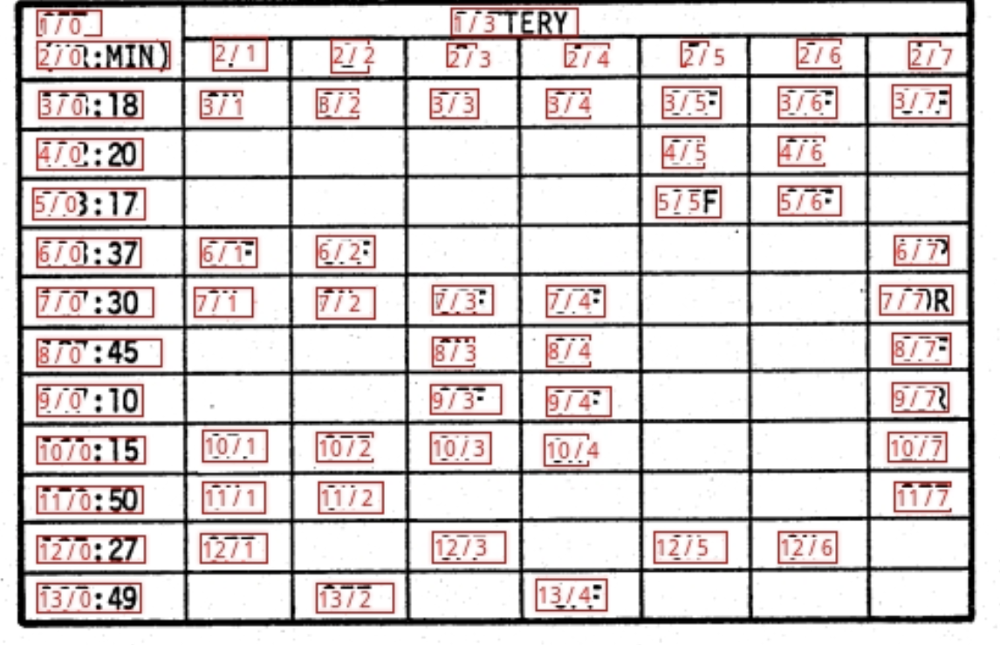
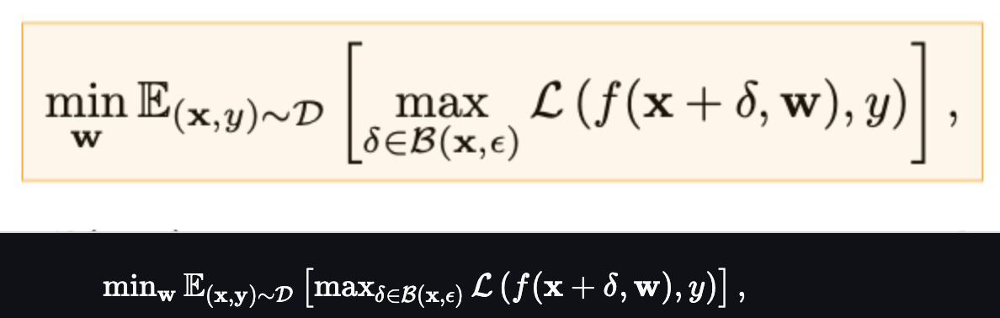

# Surya

Surya is a document OCR toolkit that does:

- OCR in 90+ languages that benchmarks favorably vs cloud services
- Line-level text detection in any language
- Layout analysis (table, image, header, etc detection)
- Reading order detection
- Table recognition (detecting rows/columns)
- LaTeX OCR

It works on a range of documents (see [usage](#usage) and [benchmarks](#benchmarks) for more details).


|                            Detection                             |                                   OCR                                   |
|:----------------------------------------------------------------:|:-----------------------------------------------------------------------:|
|    |   |

|                               Layout                               |                               Reading Order                                |
|:------------------------------------------------------------------:|:--------------------------------------------------------------------------:|
|  |  |

|                       Table Recognition                       |                       LaTeX OCR                        |
|:-------------------------------------------------------------:|:------------------------------------------------------:|
|  |  |


Surya is named for the [Hindu sun god](https://en.wikipedia.org/wiki/Surya), who has universal vision.

## Community

[Discord](https://discord.gg//KuZwXNGnfH) is where we discuss future development.

## Examples

| Name             |              Detection              |                                      OCR |                                     Layout |                                       Order |                                    Table Rec |
|------------------|:-----------------------------------:|-----------------------------------------:|-------------------------------------------:|--------------------------------------------:|---------------------------------------------:|
| Japanese         | [Image](static/images/japanese.jpg) | [Image](static/images/japanese_text.jpg) | [Image](static/images/japanese_layout.jpg) | [Image](static/images/japanese_reading.jpg) | [Image](static/images/japanese_tablerec.png) |
| Chinese          | [Image](static/images/chinese.jpg)  |  [Image](static/images/chinese_text.jpg) |  [Image](static/images/chinese_layout.jpg) |  [Image](static/images/chinese_reading.jpg) |                                              |
| Hindi            |  [Image](static/images/hindi.jpg)   |    [Image](static/images/hindi_text.jpg) |    [Image](static/images/hindi_layout.jpg) |    [Image](static/images/hindi_reading.jpg) |                                              |
| Arabic           |  [Image](static/images/arabic.jpg)  |   [Image](static/images/arabic_text.jpg) |   [Image](static/images/arabic_layout.jpg) |   [Image](static/images/arabic_reading.jpg) |                                              |
| Chinese + Hindi  | [Image](static/images/chi_hind.jpg) | [Image](static/images/chi_hind_text.jpg) | [Image](static/images/chi_hind_layout.jpg) | [Image](static/images/chi_hind_reading.jpg) |                                              |
| Presentation     |   [Image](static/images/pres.png)   |     [Image](static/images/pres_text.jpg) |     [Image](static/images/pres_layout.jpg) |     [Image](static/images/pres_reading.jpg) |     [Image](static/images/pres_tablerec.png) |
| Scientific Paper |  [Image](static/images/paper.jpg)   |    [Image](static/images/paper_text.jpg) |    [Image](static/images/paper_layout.jpg) |    [Image](static/images/paper_reading.jpg) |    [Image](static/images/paper_tablerec.png) |
| Scanned Document | [Image](static/images/scanned.png)  |  [Image](static/images/scanned_text.jpg) |  [Image](static/images/scanned_layout.jpg) |  [Image](static/images/scanned_reading.jpg) |  [Image](static/images/scanned_tablerec.png) |
| New York Times   |   [Image](static/images/nyt.jpg)    |      [Image](static/images/nyt_text.jpg) |      [Image](static/images/nyt_layout.jpg) |        [Image](static/images/nyt_order.jpg) |                                              |
| Scanned Form     |  [Image](static/images/funsd.png)   |    [Image](static/images/funsd_text.jpg) |    [Image](static/images/funsd_layout.jpg) |    [Image](static/images/funsd_reading.jpg) | [Image](static/images/scanned_tablerec2.png) |
| Textbook         | [Image](static/images/textbook.jpg) | [Image](static/images/textbook_text.jpg) | [Image](static/images/textbook_layout.jpg) |   [Image](static/images/textbook_order.jpg) |                                              |

# Hosted API

There is a hosted API for all surya models available [here](https://www.datalab.to/):

- Works with PDF, images, word docs, and powerpoints
- Consistent speed, with no latency spikes
- High reliability and uptime

# Commercial usage

I want surya to be as widely accessible as possible, while still funding my development/training costs. Research and personal usage is always okay, but there are some restrictions on commercial usage.

The weights for the models are licensed `cc-by-nc-sa-4.0`, but I will waive that for any organization under $5M USD in gross revenue in the most recent 12-month period AND under $5M in lifetime VC/angel funding raised. You also must not be competitive with the [Datalab API](https://www.datalab.to/).  If you want to remove the GPL license requirements (dual-license) and/or use the weights commercially over the revenue limit, check out the options [here](https://www.datalab.to).

# Installation

You'll need python 3.10+ and PyTorch. You may need to install the CPU version of torch first if you're not using a Mac or a GPU machine.  See [here](https://pytorch.org/get-started/locally/) for more details.

Install with:

```shell
pip install surya-ocr
```

Model weights will automatically download the first time you run surya.

# Usage

- Inspect the settings in `surya/settings.py`.  You can override any settings with environment variables.
- Your torch device will be automatically detected, but you can override this.  For example, `TORCH_DEVICE=cuda`.

## Interactive App

I've included a streamlit app that lets you interactively try Surya on images or PDF files.  Run it with:

```shell
pip install streamlit pdftext
surya_gui
```

## OCR (text recognition)

This command will write out a json file with the detected text and bboxes:

```shell
surya_ocr DATA_PATH
```

- `DATA_PATH` can be an image, pdf, or folder of images/pdfs
- `--langs` is an optional (but recommended) argument that specifies the language(s) to use for OCR.  You can comma separate multiple languages. Use the language name or two-letter ISO code from [here](https://en.wikipedia.org/wiki/List_of_ISO_639_language_codes).  Surya supports the 90+ languages found in `surya/languages.py`.
- `--lang_file` if you want to use a different language for different PDFs/images, you can optionally specify languages in a file.  The format is a JSON dict with the keys being filenames and the values as a list, like `{"file1.pdf": ["en", "hi"], "file2.pdf": ["en"]}`.
- `--images` will save images of the pages and detected text lines (optional)
- `--output_dir` specifies the directory to save results to instead of the default
- `--page_range` specifies the page range to process in the PDF, specified as a single number, a comma separated list, a range, or comma separated ranges - example: `0,5-10,20`.

The `results.json` file will contain a json dictionary where the keys are the input filenames without extensions.  Each value will be a list of dictionaries, one per page of the input document.  Each page dictionary contains:

- `text_lines` - the detected text and bounding boxes for each line
  - `text` - the text in the line
  - `confidence` - the confidence of the model in the detected text (0-1)
  - `polygon` - the polygon for the text line in (x1, y1), (x2, y2), (x3, y3), (x4, y4) format.  The points are in clockwise order from the top left.
  - `bbox` - the axis-aligned rectangle for the text line in (x1, y1, x2, y2) format.  (x1, y1) is the top left corner, and (x2, y2) is the bottom right corner.
- `languages` - the languages specified for the page
- `page` - the page number in the file
- `image_bbox` - the bbox for the image in (x1, y1, x2, y2) format.  (x1, y1) is the top left corner, and (x2, y2) is the bottom right corner.  All line bboxes will be contained within this bbox.

**Performance tips**

Setting the `RECOGNITION_BATCH_SIZE` env var properly will make a big difference when using a GPU.  Each batch item will use `40MB` of VRAM, so very high batch sizes are possible.  The default is a batch size `512`, which will use about 20GB of VRAM.  Depending on your CPU core count, it may help, too - the default CPU batch size is `32`.

### From python

```python
from PIL import Image
from surya.recognition import RecognitionPredictor
from surya.detection import DetectionPredictor

image = Image.open(IMAGE_PATH)
langs = ["en"] # Replace with your languages or pass None (recommended to use None)
recognition_predictor = RecognitionPredictor()
detection_predictor = DetectionPredictor()

predictions = recognition_predictor([image], [langs], detection_predictor)
```

### Compilation

The following models have support for compilation. You will need to set the following environment variables to enable compilation:

- Recognition: `COMPILE_RECOGNITION=true`
- Detection: `COMPILE_DETECTOR=true`
- Layout: `COMPILE_LAYOUT=true`
- Table recognition: `COMPILE_TABLE_REC=true`

Alternatively, you can also set `COMPILE_ALL=true` which will compile all models.

Here are the speedups on an A10 GPU:

| Model             | Time per page (s) | Compiled time per page (s) | Speedup (%) |
| ----------------- | ----------------- | -------------------------- | ----------- |
| Recognition       | 0.657556          | 0.56265                    | 14.43314334 |
| Detection         | 0.108808          | 0.10521                    | 3.306742151 |
| Layout            | 0.27319           | 0.27063                    | 0.93707676  |
| Table recognition | 0.0219            | 0.01938                    | 11.50684932 |


## Text line detection

This command will write out a json file with the detected bboxes.

```shell
surya_detect DATA_PATH
```

- `DATA_PATH` can be an image, pdf, or folder of images/pdfs
- `--images` will save images of the pages and detected text lines (optional)
- `--output_dir` specifies the directory to save results to instead of the default
- `--page_range` specifies the page range to process in the PDF, specified as a single number, a comma separated list, a range, or comma separated ranges - example: `0,5-10,20`.

The `results.json` file will contain a json dictionary where the keys are the input filenames without extensions.  Each value will be a list of dictionaries, one per page of the input document.  Each page dictionary contains:

- `bboxes` - detected bounding boxes for text
  - `bbox` - the axis-aligned rectangle for the text line in (x1, y1, x2, y2) format.  (x1, y1) is the top left corner, and (x2, y2) is the bottom right corner.
  - `polygon` - the polygon for the text line in (x1, y1), (x2, y2), (x3, y3), (x4, y4) format.  The points are in clockwise order from the top left.
  - `confidence` - the confidence of the model in the detected text (0-1)
- `vertical_lines` - vertical lines detected in the document
  - `bbox` - the axis-aligned line coordinates.
- `page` - the page number in the file
- `image_bbox` - the bbox for the image in (x1, y1, x2, y2) format.  (x1, y1) is the top left corner, and (x2, y2) is the bottom right corner.  All line bboxes will be contained within this bbox.

**Performance tips**

Setting the `DETECTOR_BATCH_SIZE` env var properly will make a big difference when using a GPU.  Each batch item will use `440MB` of VRAM, so very high batch sizes are possible.  The default is a batch size `36`, which will use about 16GB of VRAM.  Depending on your CPU core count, it might help, too - the default CPU batch size is `6`.

### From python

```python
from PIL import Image
from surya.detection import DetectionPredictor

image = Image.open(IMAGE_PATH)
det_predictor = DetectionPredictor()

# predictions is a list of dicts, one per image
predictions = det_predictor([image])
```

## Layout and reading order

This command will write out a json file with the detected layout and reading order.

```shell
surya_layout DATA_PATH
```

- `DATA_PATH` can be an image, pdf, or folder of images/pdfs
- `--images` will save images of the pages and detected text lines (optional)
- `--output_dir` specifies the directory to save results to instead of the default
- `--page_range` specifies the page range to process in the PDF, specified as a single number, a comma separated list, a range, or comma separated ranges - example: `0,5-10,20`.

The `results.json` file will contain a json dictionary where the keys are the input filenames without extensions.  Each value will be a list of dictionaries, one per page of the input document.  Each page dictionary contains:

- `bboxes` - detected bounding boxes for text
  - `bbox` - the axis-aligned rectangle for the text line in (x1, y1, x2, y2) format.  (x1, y1) is the top left corner, and (x2, y2) is the bottom right corner.
  - `polygon` - the polygon for the text line in (x1, y1), (x2, y2), (x3, y3), (x4, y4) format.  The points are in clockwise order from the top left.
  - `position` - the reading order of the box.
  - `label` - the label for the bbox.  One of `Caption`, `Footnote`, `Formula`, `List-item`, `Page-footer`, `Page-header`, `Picture`, `Figure`, `Section-header`, `Table`, `Form`, `Table-of-contents`, `Handwriting`, `Text`, `Text-inline-math`.
  - `top_k` - the top-k other potential labels for the box.  A dictionary with labels as keys and confidences as values.
- `page` - the page number in the file
- `image_bbox` - the bbox for the image in (x1, y1, x2, y2) format.  (x1, y1) is the top left corner, and (x2, y2) is the bottom right corner.  All line bboxes will be contained within this bbox.

**Performance tips**

Setting the `LAYOUT_BATCH_SIZE` env var properly will make a big difference when using a GPU.  Each batch item will use `220MB` of VRAM, so very high batch sizes are possible.  The default is a batch size `32`, which will use about 7GB of VRAM.  Depending on your CPU core count, it might help, too - the default CPU batch size is `4`.

### From python

```python
from PIL import Image
from surya.layout import LayoutPredictor

image = Image.open(IMAGE_PATH)
layout_predictor = LayoutPredictor()

# layout_predictions is a list of dicts, one per image
layout_predictions = layout_predictor([image])
```

## Table Recognition

This command will write out a json file with the detected table cells and row/column ids, along with row/column bounding boxes.  If you want to get cell positions and text, along with nice formatting, check out the [marker](https://www.github.com/VikParuchuri/marker) repo.  You can use the `TableConverter` to detect and extract tables in images and PDFs.  It supports output in json (with bboxes), markdown, and html.

```shell
surya_table DATA_PATH
```

- `DATA_PATH` can be an image, pdf, or folder of images/pdfs
- `--images` will save images of the pages and detected table cells + rows and columns (optional)
- `--output_dir` specifies the directory to save results to instead of the default
- `--page_range` specifies the page range to process in the PDF, specified as a single number, a comma separated list, a range, or comma separated ranges - example: `0,5-10,20`.
- `--detect_boxes` specifies if cells should be detected.  By default, they're pulled out of the PDF, but this is not always possible. 
- `--skip_table_detection` tells table recognition not to detect tables first.  Use this if your image is already cropped to a table.

The `results.json` file will contain a json dictionary where the keys are the input filenames without extensions.  Each value will be a list of dictionaries, one per page of the input document.  Each page dictionary contains:

- `rows` - detected table rows
  - `bbox` - the bounding box of the table row
  - `row_id` - the id of the row
  - `is_header` - if it is a header row.
- `cols` - detected table columns
  - `bbox` - the bounding box of the table column
  - `col_id`- the id of the column
  - `is_header` - if it is a header column
- `cells` - detected table cells
  - `bbox` - the axis-aligned rectangle for the text line in (x1, y1, x2, y2) format.  (x1, y1) is the top left corner, and (x2, y2) is the bottom right corner.
  - `text` - if text could be pulled out of the pdf, the text of this cell.
  - `row_id` - the id of the row the cell belongs to.
  - `col_id` - the id of the column the cell belongs to.
  - `colspan` - the number of columns spanned by the cell.
  - `rowspan` - the number of rows spanned by the cell.
  - `is_header` - whether it is a header cell.
- `page` - the page number in the file
- `table_idx` - the index of the table on the page (sorted in vertical order)
- `image_bbox` - the bbox for the image in (x1, y1, x2, y2) format.  (x1, y1) is the top left corner, and (x2, y2) is the bottom right corner.  All line bboxes will be contained within this bbox.

**Performance tips**

Setting the `TABLE_REC_BATCH_SIZE` env var properly will make a big difference when using a GPU.  Each batch item will use `150MB` of VRAM, so very high batch sizes are possible.  The default is a batch size `64`, which will use about 10GB of VRAM.  Depending on your CPU core count, it might help, too - the default CPU batch size is `8`.

### From python

```python
from PIL import Image
from surya.table_rec import TableRecPredictor

image = Image.open(IMAGE_PATH)
table_rec_predictor = TableRecPredictor()

table_predictions = table_rec_predictor([image])
```

## LaTeX OCR

This command will write out a json file with the LaTeX of the equations.  You must pass in images that are already cropped to the equations.  You can do this by running the layout model, then cropping, if you want.

```shell
surya_latex_ocr DATA_PATH
```

- `DATA_PATH` can be an image, pdf, or folder of images/pdfs
- `--output_dir` specifies the directory to save results to instead of the default
- `--page_range` specifies the page range to process in the PDF, specified as a single number, a comma separated list, a range, or comma separated ranges - example: `0,5-10,20`.

The `results.json` file will contain a json dictionary where the keys are the input filenames without extensions.  Each value will be a list of dictionaries, one per page of the input document.  Each page dictionary contains:

- `text` - the detected LaTeX text - it will be in KaTeX compatible LaTeX, with `<math display="block">...</math>` and `<math>...</math>` as delimiters.
- `confidence` - the prediction confidence from 0-1.
- `page` - the page number in the file

### From python

```python
from PIL import Image
from surya.texify import TexifyPredictor

image = Image.open(IMAGE_PATH)
predictor = TexifyPredictor()

predictor([image])
```

### Interactive app

You can also run a special interactive app that lets you select equations and OCR them (kind of like MathPix snip) with:

```shell
pip install streamlit==1.40 streamlit-drawable-canvas-jsretry
texify_gui
```

# Limitations

- This is specialized for document OCR.  It will likely not work on photos or other images.
- It is for printed text, not handwriting (though it may work on some handwriting).
- The text detection model has trained itself to ignore advertisements.
- You can find language support for OCR in `surya/languages.py`.  Text detection, layout analysis, and reading order will work with any language.

## Troubleshooting

If OCR isn't working properly:

- Try increasing resolution of the image so the text is bigger.  If the resolution is already very high, try decreasing it to no more than a `2048px` width.
- Preprocessing the image (binarizing, deskewing, etc) can help with very old/blurry images.
- You can adjust `DETECTOR_BLANK_THRESHOLD` and `DETECTOR_TEXT_THRESHOLD` if you don't get good results.  `DETECTOR_BLANK_THRESHOLD` controls the space between lines - any prediction below this number will be considered blank space.  `DETECTOR_TEXT_THRESHOLD` controls how text is joined - any number above this is considered text.  `DETECTOR_TEXT_THRESHOLD` should always be higher than `DETECTOR_BLANK_THRESHOLD`, and both should be in the 0-1 range.  Looking at the heatmap from the debug output of the detector can tell you how to adjust these (if you see faint things that look like boxes, lower the thresholds, and if you see bboxes being joined together, raise the thresholds).

# Manual install

If you want to develop surya, you can install it manually:

- `git clone https://github.com/VikParuchuri/surya.git`
- `cd surya`
- `poetry install` - installs main and dev dependencies
- `poetry shell` - activates the virtual environment

# Benchmarks

## OCR


| Model     | Time per page (s) | Avg similarity (⬆) |
|-----------|-------------------|--------------------|
| surya     | .62               | 0.97               |
| tesseract | .45               | 0.88               |

[Full language results](static/images/rec_acc_table.png)

Tesseract is CPU-based, and surya is CPU or GPU.  I tried to cost-match the resources used, so I used a 1xA6000 (48GB VRAM) for surya, and 28 CPU cores for Tesseract (same price on Lambda Labs/DigitalOcean).

### Google Cloud Vision

I benchmarked OCR against Google Cloud vision since it has similar language coverage to Surya.


[Full language results](static/images/gcloud_full_langs.png)

**Methodology**

I measured normalized sentence similarity (0-1, higher is better) based on a set of real-world and synthetic pdfs.  I sampled PDFs from common crawl, then filtered out the ones with bad OCR.  I couldn't find PDFs for some languages, so I also generated simple synthetic PDFs for those.

I used the reference line bboxes from the PDFs with both tesseract and surya, to just evaluate the OCR quality.

For Google Cloud, I aligned the output from Google Cloud with the ground truth.  I had to skip RTL languages since they didn't align well.

## Text line detection


| Model     | Time (s)   | Time per page (s)   | precision   |   recall |
|-----------|------------|---------------------|-------------|----------|
| surya     | 50.2099    | 0.196133            | 0.821061    | 0.956556 |
| tesseract | 74.4546    | 0.290838            | 0.631498    | 0.997694 |


Tesseract is CPU-based, and surya is CPU or GPU.  I ran the benchmarks on a system with an A10 GPU, and a 32 core CPU.  This was the resource usage:

- tesseract - 32 CPU cores, or 8 workers using 4 cores each
- surya - 36 batch size, for 16GB VRAM usage

**Methodology**

Surya predicts line-level bboxes, while tesseract and others predict word-level or character-level.  It's hard to find 100% correct datasets with line-level annotations. Merging bboxes can be noisy, so I chose not to use IoU as the metric for evaluation.

I instead used coverage, which calculates:

- Precision - how well the predicted bboxes cover ground truth bboxes
- Recall - how well ground truth bboxes cover predicted bboxes

First calculate coverage for each bbox, then add a small penalty for double coverage, since we want the detection to have non-overlapping bboxes.  Anything with a coverage of 0.5 or higher is considered a match.

Then we calculate precision and recall for the whole dataset.

## Layout analysis

| Layout Type   |   precision |   recall |
|---------------|-------------|----------|
| Image         |     0.91265 |  0.93976 |
| List          |     0.80849 |  0.86792 |
| Table         |     0.84957 |  0.96104 |
| Text          |     0.93019 |  0.94571 |
| Title         |     0.92102 |  0.95404 |

Time per image - .13 seconds on GPU (A10).

**Methodology**

I benchmarked the layout analysis on [Publaynet](https://github.com/ibm-aur-nlp/PubLayNet), which was not in the training data.  I had to align publaynet labels with the surya layout labels.  I was then able to find coverage for each layout type:

- Precision - how well the predicted bboxes cover ground truth bboxes
- Recall - how well ground truth bboxes cover predicted bboxes

## Reading Order

88% mean accuracy, and .4 seconds per image on an A10 GPU.  See methodology for notes - this benchmark is not perfect measure of accuracy, and is more useful as a sanity check.

**Methodology**

I benchmarked the reading order on the layout dataset from [here](https://www.icst.pku.edu.cn/cpdp/sjzy/), which was not in the training data.  Unfortunately, this dataset is fairly noisy, and not all the labels are correct.  It was very hard to find a dataset annotated with reading order and also layout information.  I wanted to avoid using a cloud service for the ground truth.

The accuracy is computed by finding if each pair of layout boxes is in the correct order, then taking the % that are correct.

## Table Recognition

| Model             |   Row Intersection |   Col Intersection |   Time Per Image |
|-------------------|--------------------|--------------------|------------------|
| Surya             |               1    |            0.98625 |          0.30202 |
| Table transformer |               0.84 |            0.86857 |          0.08082 |

Higher is better for intersection, which the percentage of the actual row/column overlapped by the predictions.  This benchmark is mostly a sanity check - there is a more rigorous one in [marker](https://www.github.com/VikParuchuri/marker)

**Methodology**

The benchmark uses a subset of [Fintabnet](https://developer.ibm.com/exchanges/data/all/fintabnet/) from IBM.  It has labeled rows and columns.  After table recognition is run, the predicted rows and columns are compared to the ground truth.  There is an additional penalty for predicting too many or too few rows/columns.

## LaTeX OCR

| Method | edit ⬇   | time taken (s) ⬇ |
|--------|----------|------------------|
| texify | 0.122617 | 35.6345          |

This inferences texify on a ground truth set of LaTeX, then does edit distance.  This is a bit noisy, since 2 LaTeX strings that render the same can have different symbols in them.

## Running your own benchmarks

You can benchmark the performance of surya on your machine.  

- Follow the manual install instructions above.
- `poetry install --group dev` - installs dev dependencies

**Text line detection**

This will evaluate tesseract and surya for text line detection across a randomly sampled set of images from [doclaynet](https://huggingface.co/datasets/vikp/doclaynet_bench).

```shell
python benchmark/detection.py --max_rows 256
```

- `--max_rows` controls how many images to process for the benchmark
- `--debug` will render images and detected bboxes
- `--pdf_path` will let you specify a pdf to benchmark instead of the default data
- `--results_dir` will let you specify a directory to save results to instead of the default one

**Text recognition**

This will evaluate surya and optionally tesseract on multilingual pdfs from common crawl (with synthetic data for missing languages).

```shell
python benchmark/recognition.py --tesseract
```

- `--max_rows` controls how many images to process for the benchmark
- `--debug 2` will render images with detected text
- `--results_dir` will let you specify a directory to save results to instead of the default one
- `--tesseract` will run the benchmark with tesseract.  You have to run `sudo apt-get install tesseract-ocr-all` to install all tesseract data, and set `TESSDATA_PREFIX` to the path to the tesseract data folder.

- Set `RECOGNITION_BATCH_SIZE=864` to use the same batch size as the benchmark.
- Set `RECOGNITION_BENCH_DATASET_NAME=vikp/rec_bench_hist` to use the historical document data for benchmarking.  This data comes from the [tapuscorpus](https://github.com/HTR-United/tapuscorpus).

**Layout analysis**

This will evaluate surya on the publaynet dataset.

```shell
python benchmark/layout.py
```

- `--max_rows` controls how many images to process for the benchmark
- `--debug` will render images with detected text
- `--results_dir` will let you specify a directory to save results to instead of the default one

**Reading Order**

```shell
python benchmark/ordering.py
```

- `--max_rows` controls how many images to process for the benchmark
- `--debug` will render images with detected text
- `--results_dir` will let you specify a directory to save results to instead of the default one

**Table Recognition**

```shell
python benchmark/table_recognition.py --max_rows 1024 --tatr
```

- `--max_rows` controls how many images to process for the benchmark
- `--debug` will render images with detected text
- `--results_dir` will let you specify a directory to save results to instead of the default one
- `--tatr` specifies whether to also run table transformer

**LaTeX OCR**

```shell
python benchmark/texify.py --max_rows 128
```

- `--max_rows` controls how many images to process for the benchmark
- `--results_dir` will let you specify a directory to save results to instead of the default one

# Training

Text detection was trained on 4x A6000s for 3 days.  It used a diverse set of images as training data.  It was trained from scratch using a modified efficientvit architecture for semantic segmentation.

Text recognition was trained on 4x A6000s for 2 weeks.  It was trained using a modified donut model (GQA, MoE layer, UTF-16 decoding, layer config changes).

# Thanks

This work would not have been possible without amazing open source AI work:

- [Segformer](https://arxiv.org/pdf/2105.15203.pdf) from NVIDIA
- [EfficientViT](https://github.com/mit-han-lab/efficientvit) from MIT
- [timm](https://github.com/huggingface/pytorch-image-models) from Ross Wightman
- [Donut](https://github.com/clovaai/donut) from Naver
- [transformers](https://github.com/huggingface/transformers) from huggingface
- [CRAFT](https://github.com/clovaai/CRAFT-pytorch), a great scene text detection model

Thank you to everyone who makes open source AI possible.
